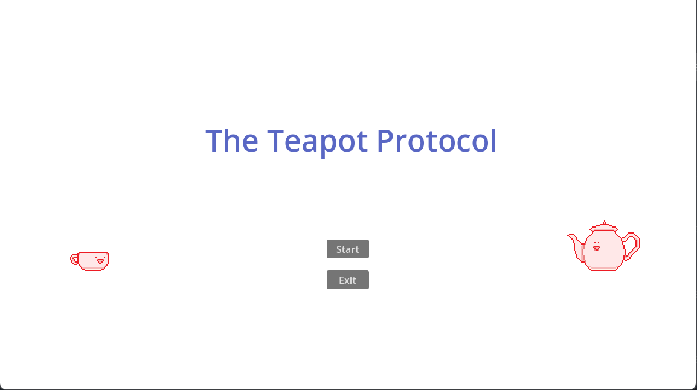
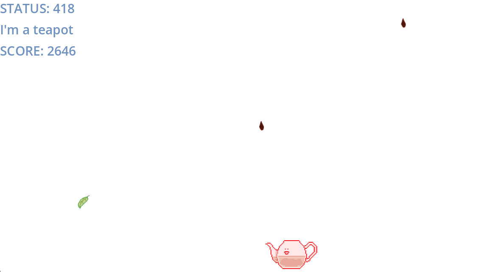

# The Teapot Protocol

HTCPCPで定義されたステータスコード `418 I'm a teapot` をテーマにした、Godot製の2Dアクションゲームです。落ちてくるコーヒーを避け、ハイスコアを目指します。

本リポジトリは、以前に個人制作したゲームを公開用に整理したものです。

## スクリーンショット

### タイトル画面

### ゲーム画面

## モチーフ

本作は、1998年のエイプリルフールRFCであるHTCPCP（RFC 2324, Hyper Text Coffee Pot Control Protocol）で定義された `418 I'm a teapot` をモチーフにしています。
HTCPCPはHTTPを基盤としたジョーク仕様で、418はコーヒーを淹れるよう要求されたティーポットが返すステータスコードとして定義されています。本作でプレイヤーがコーヒーを避けるのはこのためです。
なお、現在のHTTP仕様では、418は「未使用・予約済み」のステータスコードとして扱われています。

## 特徴

- `418 I'm a teapot` の世界観を、コーヒーを避け紅茶を集めるゲームルールに落とし込んだコンセプト
- コーヒー、紅茶、茶葉を使い分ける、シンプルな回避・回復アクション
- ティーポットの紅茶量に応じて見た目と移動速度が変化する、リスク・リターンのあるゲーム設計
- Intro、タイトル、難易度選択、ポーズ、ゲームオーバーを含むゲームフロー

## 動作環境

- Godot Engine 4.4

## 起動方法

1. Godot Engine 4.4で `project.godot` をImportします。
2. エディタ上部の実行ボタン、または `F6` / `F5` で起動します。
3. 初回は素材のインポート完了後に実行してください。

## 操作方法

| 操作 | 内容 |
| --- | --- |
| 左右矢印キー | ティーポットを左右に移動 |
| Esc | ポーズメニューの表示・解除 |

## ゲームルール

- スコアは生存時間に応じて増加します。
- コーヒーに当たると紅茶量（HP）が1減少します。
- 茶葉に当たると、一定時間 `200 OK` 状態になります。
- `200 OK` 状態の間は、紅茶が降ってきます。
- 紅茶に当たると紅茶量が1段階回復します。
- 紅茶量は「満タン」「半分」「空」の3段階で表現され、満タン以上には回復しません。
- 紅茶量が空の状態でさらにコーヒーに当たるとゲームオーバーです。

### 難易度

難易度によって、ゲーム開始時の紅茶量が変わります。

| 選択肢 | 難易度 | 開始時の紅茶量 |
| --- | --- | --- |
| Full | Easy | 満タン |
| Half-full | Normal | 半分 |
| Empty | Hard | 空 |

## 技術構成

- Engine: Godot Engine 4.4
- Language: GDScript
- Genre: 2D action game

## 素材・著作権

本リポジトリに含まれるゲームのソースコード、画像素材、UIデザインはすべて自作です。

## 今後の実装予定

- 音量・効果音・画面設定などのOptions機能
- ゲーム開始時に任意のHTTPステータス（`404 Not Found` など）を指定できるHacking Mode
- 難易度ごとの茶葉出現率と効果時間の調整
- アイテム取得時・ダメージ時の演出や効果音の追加

## ライセンス

ライセンスは [`LICENSE`](LICENSE) を参照してください。
